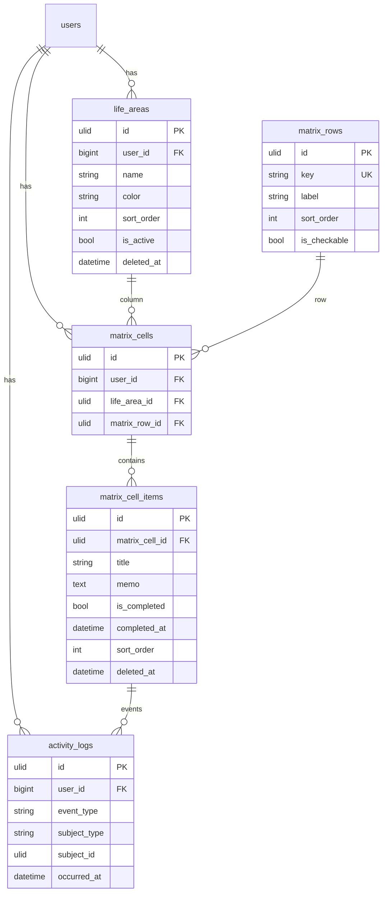
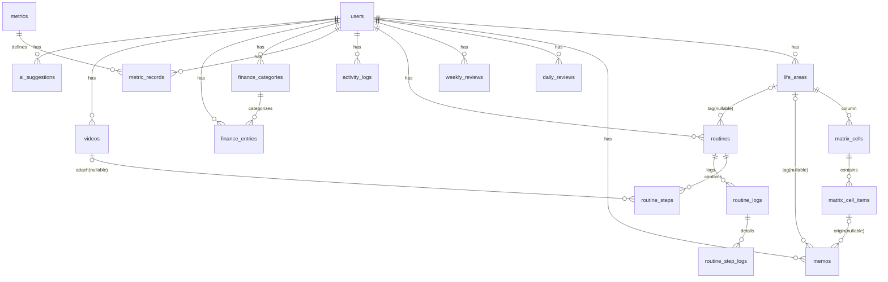

# 全体 ER 図と横串 FK 方針

Phase 1 の Matrix 中核 4 テーブル + 横断イベントログ **activity_logs** は Phase 1 設計書 v0.3
をベースに確定（activity_logs は M1 追加）。それ以外の後続フェーズのテーブルは **ドラフト** であり、
各マイルストーン着手前に確定させる。

## Phase 1（確定）

- `matrix_rows` はグローバルマスタ（user_id を持たない）。seed で固定 3 行を投入する
- `matrix_cells` は unique(user_id, life_area_id, matrix_row_id) で重複禁止
- **activity_logs** は M1 で作成・記録開始（`matrix_item_completed` / `matrix_item_reopened`）。
  実行履歴 UI（/history）は M3

## v0 全体（後続フェーズ・ドラフト）

カラムレベルの定義は [tables.md](./tables.md) を参照。

## 横串 FK 方針

- `life_area_id` は L2 モジュール（memos / routines / metric_records / finance_entries / videos）で
  **nullable な任意タグ** として持つ
- 領域の非表示（`is_active = false`）時も FK は保持する（データを失わない）
- 領域は物理削除しない運用を基本とするため、FK の on delete は restrict を基本とする

## イベントログ（activity_logs）方針（確定）

実行履歴の基盤。不変のイベントログとして 1 テーブルに時系列で記録する。
TOP Matrix 自体のスナップショット履歴ではない。

| イベント種別 | 記録開始 | 発生元 | 記録内容 |
|---|---|---|---|
| matrix_item_completed | **M1** | セル項目の完了切替（完了時） | subject: matrix_cell_item_id, occurred_at |
| matrix_item_reopened | **M1** | セル項目の完了取り消し | subject: matrix_cell_item_id, occurred_at |
| routine_completed | **M3** | ルーティン実行の完了 | subject: routine_log_id, occurred_at |

- subject はポリモーフィック参照（subject_type + subject_id）とする
- ログは不変（更新・削除しない）。完了取り消しは `matrix_item_reopened` イベントを追加する
- 実行履歴 UI（GET /history）は **M3** で実装。M1 では記録のみ
- 日次・週次振り返りは M2 初期は `completed_at` 参照。将来的に activity_logs を参照できるようにする

## 想定データ規模とクエリ方針

| テーブル群 | 想定規模 | 方針 |
|---|---|---|
| Matrix 系 | 数百件 | TOP 表示は Query 集約 1 体系で取得。N+1 を作らない |
| メモ / ログ / 記録 | 年間数千件級 | 一覧はページネーション必須。グラフは期間指定 + 集計クエリ |
| Finance | 年間数百〜千件 | 月単位表示。年間集計は集計クエリ |
