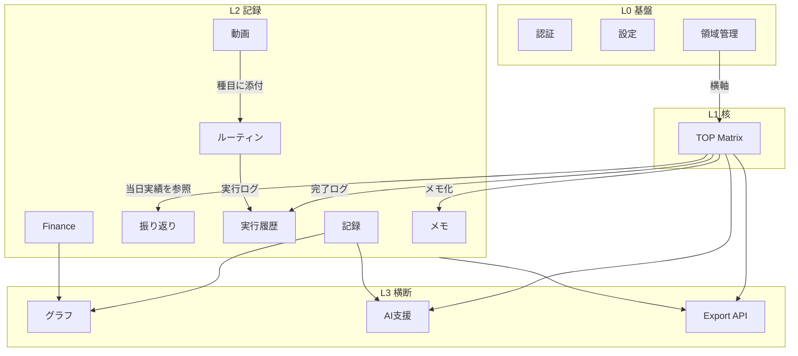

# 情報設計（Information Architecture）

## 全体構造

v0 は「TOP Matrix を核に、記録系モジュールが取り囲み、分析・支援層が横断する」4 層構造とする。

| 層 | 内容 | 役割 |
|---|---|---|
| L0 基盤 | 認証（Fortify）/ 設定 / 領域管理（Life Area） | ユーザーと横軸の定義 |
| L1 核 | TOP Matrix（領域 × 固定 3 行 × セル内項目） | 思考整理と行動決定の中心。ユーザーごとに 1 つ |
| L2 記録 | メモ / 日次・週次振り返り / ルーティン→実行履歴 / 計測記録（体重・睡眠・筋力・野球）/ Finance / 動画 | 日々の行動と状態の蓄積 |
| L3 横断 | グラフ / AI 支援 / Export API | 蓄積データの可視化・提案・v1 移行 |

## 共通原則

- 全ユーザーデータは `user_id` でスコープする（マルチテナント概念は持ち込まない）
- 新規ドメインテーブルの主キーは ULID。既存 `users.id` は BIGINT（`user_id` FK は bigint unsigned）
- Life Area（領域）が全モジュールを貫く横串タグ（L2 の各データは任意で領域に紐づく）
- TOP に履歴は持たない。履歴は L2（振り返り・実行履歴）側に残す
- PC 16:9 を主軸、実装はレスポンシブ

## サイドバー構成

UI 仕様書 v2 準拠: 幅 168px、深紫→藤色の縦グラデーション、上部に CD ロゴと月、
下部に星・植物線画。アイコンは Lucide（SVG / `stroke="currentColor"` / 線幅 1.6 統一）。

| 順 | 項目 | アイコン (Lucide) | ルート | 提供フェーズ |
|---|---|---|---|---|
| - | CD ロゴ + 月（装飾） | - | - | 1 |
| 1 | ダッシュボード | Home | /dashboard | 1 |
| 2 | メモ | Pencil | /memos | 1.5 |
| 3 | 振り返り | Notebook | /reviews | 1.5 |
| 4 | ルーティン | CircleCheck | /routines | 2 |
| 5 | 記録（ヘルス記録ハブ） | ChartLine | /records | 2.5 |
| 6 | Finance | Wallet | /finance | 3 |
| 7 | 動画 | Clapperboard | /videos | 3.5 |
| 8 | AI 支援 | Sparkles | /ai | 4 |
| 下部 | 設定 | Settings | /settings | 1 |
| - | 星・植物線画（装飾） | - | - | 1 |

### サイドバーの方針

- 領域管理はサイドバーに置かない（ナビを 8 + 設定に抑え、世界観を守る）。
  導線は「TOP マトリクスのヘッダー編集ボタン」と「設定 > 領域管理」の 2 箇所
- 未実装フェーズの項目は非表示にする（グレーアウトで出さない）。
  Phase 1 時点の表示は「ダッシュボード」「設定」のみ
- サイドバー全体を画像化しない。CSS グラデーション + SVG 装飾で構成する

## 全画面一覧

| # | 画面 | ルート | Phase | 状態 |
|---|---|---|---|---|
| 1 | ログイン / 新規登録 / パスワード再設定 | /login 等 | 1 | 既存 Fortify（デザイン調整は後続） |
| 2 | TOP ダッシュボード（マトリクスシート） | /dashboard | 1 | 新規（核） |
| 3 | セル編集モーダル | /dashboard 内モーダル | 1 | 新規 |
| 4 | 領域管理 | /life-areas | 1 | 新規 |
| 5 | 設定（プロフィール / セキュリティ / 外観） | /settings/* | 1 | 既存 + 領域管理導線追加 |
| 6 | メモ一覧・編集 | /memos | 1.5 | 新規 |
| 7 | 日次振り返り | /reviews/daily/{date} | 1.5 | 新規 |
| 8 | 週次振り返り | /reviews/weekly/{week} | 1.5 | 新規 |
| 9 | 振り返り一覧 | /reviews | 1.5 | 新規 |
| 10 | ルーティン管理 | /routines | 2 | 新規 |
| 11 | ルーティン実行（トレーニング実行） | /routines/{routine}/run | 2 | 新規 |
| 12 | 実行履歴 | /history | 2 (M3) | 新規 |
| 13 | 記録（体重 / 睡眠 / 筋力 / 野球 タブ + グラフ） | /records/{metric} | 2.5 | 新規 |
| 14 | Finance（収支記録 + 月次サマリ） | /finance | 3 | 新規 |
| 15 | 動画ライブラリ | /videos | 3.5 | 新規 |
| 16 | AI 支援 | /ai | 4 | 新規 |
| 17 | Export（v1 移行） | /settings/export | 4.5 | 新規（設定配下） |

各画面の目的と主要操作は `docs/product/screens/` 配下の各ドキュメントを参照。

## TOP Matrix と各機能の接続関係

TOP Matrix はハブ。接続は「参照（読む）」中心とし、Matrix 側のデータ構造を汚さない。

| 機能 | 接続方向 | 接続内容 |
|---|---|---|
| 領域管理 | 双方向 | 横軸そのもの。領域の追加 = 列の追加、非表示 = 列の非表示（セルデータは保持） |
| メモ | Matrix→メモ | セル項目から「メモとして残す」導線。メモ側は `life_area_id` を任意タグとして持つ |
| 日次振り返り | Matrix→振り返り | M2 初期は completed_at 参照。将来的に activity_logs 参照へ移行 |
| 週次振り返り | Matrix→振り返り | 週内の完了実績と領域バランスをサマリ表示 |
| ルーティン | 独立 + 参照 | ルーティンは独立管理。当日実施予定を TOP に補助表示するかは未決定 |
| 実行履歴 | Matrix→履歴 | M1 から activity_logs に記録。実行履歴 UI（/history）は M3 |
| 記録 / グラフ | 将来像との対応 | 「将来どうなっていたいか」の目標と数値記録を `life_area` 経由で突き合わせ |
| Finance | 弱い接続 | 独立モジュール。領域タグは任意 |
| 動画 | 間接 | ルーティン（種目）に添付。Matrix とは直接つながない |
| AI 支援 | Matrix⇔AI | マトリクス全体 + 直近記録を入力に「今やるべきこと」候補を提案。採用時はセル項目として追加 |
| Export API | 全体→出力 | Matrix 含む全モジュールのデータを JSON で出力 |

## URL 設計の方針

- Inertia のページ遷移を基本とし、SPA 的な部分更新は Inertia の partial reload を使う
- ID は ULID を URL にそのまま露出してよい（推測困難・時系列順）
- 日付を含む URL は `YYYY-MM-DD`（日次）/ `YYYY-Www`（ISO 週。例 `2026-W27`）で表現する
