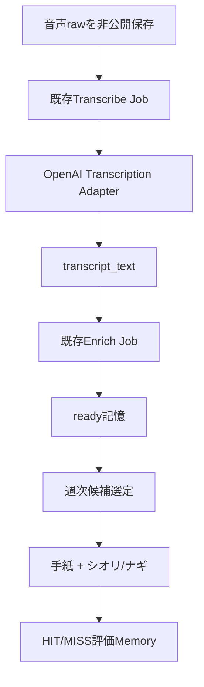

# キオク残実装 最終設計・一括実装指示
## 実文字起こし + 2キャラクターのコンシェルジュ手紙実験

- 作成日: 2026-07-15
- 状態: **実装開始可能**
- 対象: Clear Dawn OS / キオク
- 想定実装者: Fable 5 Auto
- 起点: 最新の `origin/develop`
- 実装単位: 1 feature branch / 1 Draft PR（内部ではPhase A→Bの順に検証）
- 添付必須: `shiori.webp` / `nagi.webp`

---

## 0. 結論

残っている実装は次の2つだけである。

| Phase | 残課題 | 今回の完成状態 |
|---|---|---|
| A | 実際の音声→文字起こし→AI整理 | 既存`TranscriptionGateway`へOpenAI実providerを接続し、保存済み原音声から日本語transcriptを生成して既存enrichへ渡す |
| B | コンシェルジュ手紙実験 | 週1通、最大5件、0件許容の手紙を手動生成し、シオリまたはナギを手紙カード内の右側へ表示してHIT/MISSを評価・保存する |
| C（追補） | 日次pilot + 安全停止 | 14日日次pilot → 終了後は週次。sensitive haltの実効停止、test/preview、failed retry。詳細は [kioku-concierge-daily-pilot.md](./kioku-concierge-daily-pilot.md) |

QC-1〜QC-3で完成済みの保存・音声・Job基盤を作り直してはいけない。今回追加するのは、**実provider adapter**と、**能動想起を検証する薄いLetter機能**である。

> **cadence 更新（2026-07-14）**: 初期実験は「4週の週次」から **14日日次pilot（2026-07-15〜2026-07-28）→ 終了後は週次** へ変更した。日付はコードへ直書きせず、`kioku:letters:pilot:start` の引数として DB に記録する。「送る」はアプリ内表示のみ（メール/pushではない）。Phase B の候補選定・summary-only AI・厳格JSON検証は再利用する。



---

## 1. 実装前に確認する現状

以下は実装済みとして扱い、同じ責務のクラス・カラム・ルートを重複追加しない。

### 1.1 クイックキャプチャ／音声

- textは`raw_content`だけで即保存できる
- voiceは停止時にBlobをIndexedDBへ永続化し、サーバーへ冪等同期する
- `(user_id, client_capture_id)` uniqueで重複作成を防ぐ
- 原音声は`memory_assets`へ非公開保存される
- 本番の永続private object storageとChrome / iPhone Safariで再生確認済み
- `raw_content`はEloquent更新ガードで不変
- `transcript_text`は派生データ
- `transcription_status`は`pending / processing / ready / failed`
- `TranscriptionGateway` interface
- `NullTranscriptionGateway` / `FakeTranscriptionGateway`
- `TranscribeMemoryAudioJob`
- 条件付きUPDATEによるclaim + `ShouldBeUnique`
- 成功時に既存`EnrichMemoryJob`へ接続
- 文字起こし失敗時もMemoryと原音声を保持
- `retry-transcription`
- `kioku:transcriptions:dispatch-pending --dry-run / --user=`
- provider=`none`時の正確なUI表示
- empty transcript用の`empty_ready`表示
- transcriptを検索対象へ含める処理

### 1.2 共通基盤

- 既存`AiGateway`
- AI利用台帳（`AiUsageRequest` / `AiUsageLog` / `AiUsageMonthly`等）
- 版付き`PromptTemplate`
- database queue
- Kioku Home / Detail / status polling
- frontend asset boundary / asset budget

### 1.3 現時点で未実装

- `none` / `fake`以外の実`TranscriptionGateway`
- 実provider利用量のAI台帳統合
- コンシェルジュLetterのDB・生成・UI・評価
- シオリ／ナギWebPのリポジトリ配置と表示

実コードがこの一覧と異なる場合は、現行コードと`docs/`を先に監査し、既存責務を再利用する。差異を理由に全体を作り直してはいけない。

---

# Phase A — 実文字起こし

## 2. provider決定

### 2.1 採用

| 項目 | 決定 |
|---|---|
| provider key | `openai` |
| model | `gpt-4o-mini-transcribe-2025-12-15` |
| endpoint | `POST https://api.openai.com/v1/audio/transcriptions` |
| mode | 完成済み音声ファイルの非ストリーミング文字起こし |
| language | `ja` |
| response format | `json` |
| realtime | 不採用 |
| diarization | 不採用 |

採用理由:

- 3分以内の個人音声メモにはリアルタイム接続が不要
- `gpt-4o-mini-transcribe-2025-12-15`は短い実会話・雑音・日本語で改善された固定snapshot
- APIは`mp4 / m4a / webm / wav / mp3 / ogg`等を受け付ける
- 現行20MB上限は、ファイルupload方式の25MB上限内
- 既存のQC-3 interfaceへadapterを1つ追加すれば済む

公式資料:

- [Speech to text guide](https://developers.openai.com/api/docs/guides/speech-to-text)
- [Create transcription API](https://developers.openai.com/api/reference/resources/audio/subresources/transcriptions/methods/create/)
- [GPT-4o mini Transcribe](https://developers.openai.com/api/docs/models/gpt-4o-mini-transcribe)
- [2025-12-15 audio model update](https://developers.openai.com/blog/updates-audio-models)

### 2.2 設定

既存`config/kioku.php`の形へ合わせ、論理的に次を持たせる。

```php
'transcription' => [
    'provider' => env('KIOKU_TRANSCRIPTION_PROVIDER', 'none'),
    'model' => env(
        'KIOKU_TRANSCRIPTION_MODEL',
        'gpt-4o-mini-transcribe-2025-12-15',
    ),
    'language' => env('KIOKU_TRANSCRIPTION_LANGUAGE', 'ja'),
    'timeout_seconds' => (int) env('KIOKU_TRANSCRIPTION_TIMEOUT', 120),
],
```

秘密情報はOpenAIの共通configが既にあれば再利用する。無ければ`config/services.php`へ追加する。

```php
'openai' => [
    'key' => env('OPENAI_API_KEY'),
    'base_url' => env('OPENAI_BASE_URL', 'https://api.openai.com/v1'),
],
```

`.env.example`へキー名だけ追加する。実値をGit、PR、ログ、テストfixtureへ書かない。

```dotenv
OPENAI_API_KEY=
OPENAI_BASE_URL=https://api.openai.com/v1
KIOKU_TRANSCRIPTION_PROVIDER=none
KIOKU_TRANSCRIPTION_MODEL=gpt-4o-mini-transcribe-2025-12-15
KIOKU_TRANSCRIPTION_LANGUAGE=ja
KIOKU_TRANSCRIPTION_TIMEOUT=120
```

productionの既定をコード上で`openai`にしてはいけない。環境変数を設定するまでは`none`を維持する。

---

## 3. OpenAI adapter

既存interfaceの実際のsignatureへ合わせ、論理的に次を追加する。

```text
app/Domain/Kioku/Transcription/OpenAiTranscriptionGateway.php
```

AppServiceProvider等の既存bindingへ`openai`分岐を追加する。

```text
none   -> NullTranscriptionGateway
fake   -> FakeTranscriptionGateway
openai -> OpenAiTranscriptionGateway
unknown -> 起動または解決時に明示エラー
```

### 3.1 request

1. `MemoryAsset`に保存された**サーバー検出済みMIME**を使う
2. `Storage::disk($asset->disk)->readStream($asset->path)`でstreamを開く
3. 全音声をbase64やメモリ文字列へ変換しない
4. multipartの`file`としてattachする
5. `model`、`language=ja`、`response_format=json`を送る
6. streamは`finally`で閉じる

概念コード:

```php
$stream = Storage::disk($asset->disk)->readStream($asset->path);

try {
    $response = Http::withToken(config('services.openai.key'))
        ->baseUrl(config('services.openai.base_url'))
        ->connectTimeout(10)
        ->timeout(config('kioku.transcription.timeout_seconds'))
        ->attach('file', $stream, $safeFilename, [
            'Content-Type' => $asset->mime_type,
        ])
        ->post('/audio/transcriptions', [
            'model' => config('kioku.transcription.model'),
            'language' => config('kioku.transcription.language'),
            'response_format' => 'json',
        ]);
} finally {
    if (is_resource($stream)) {
        fclose($stream);
    }
}
```

実コードでは、既存HTTP client wrapperやprovider基盤があればそちらを使う。

### 3.2 MIMEとファイル名

OpenAIへ渡すファイル名は、クライアント申告拡張子ではなく、保存済み`mime_type`からallow-listで決める。

| MIME | extension |
|---|---|
| `audio/webm` | `webm` |
| `audio/mp4` | `m4a` |
| `audio/mpeg` | `mp3` |
| `audio/ogg` | `ogg` |
| `audio/wav` / `audio/x-wav` | `wav` |

未知MIMEはproviderへ送らず、permanent failureとして記録する。API key、object storage path、署名URLをエラーメッセージへ含めない。

### 3.3 response

- HTTP成功かつJSON `text`がstringなら成功
- `trim()`後に空文字でも**正常終了**とする
- 空文字は`transcription_status=ready`、`transcript_text=''`
- UIは既存`empty_ready`で「音声を認識できませんでした」と表示
- JSON不正、`text`欠落、型不正はprovider response error
- raw response本文をログへ保存しない

### 3.4 error分類

| 種別 | 例 | 扱い |
|---|---|---|
| configuration | API key無し、未知provider/model | 外部送信せず失敗。修正後に再実行 |
| permanent | unsupported MIME、401、403、通常の400/422 | retryで課金を重ねず`failed` |
| transient | 408、409、429、5xx、timeout、接続失敗 | 既存Jobの上限付きretryへ委ねる |
| storage | asset不存在、readStream失敗 | providerを呼ばず`failed` |
| stale | claim喪失、対象status/version不一致 | 書き込まず終了 |

HTTP adapter内で無制限retryしない。JobとHTTP clientの二重retryによる重複課金を避ける。

---

## 4. 既存Jobとの接続

`TranscribeMemoryAudioJob`の次の不変条件を維持する。

- `ShouldBeUnique`
- 条件付きUPDATEによる`pending -> processing` claim
- Job開始前にvoice、Asset、所有状態を確認
- provider成功時のみclaim所有者が`transcript_text`を保存
- stale Jobは書き込まない
- 成功後だけ`EnrichMemoryJob`をdispatch
- 失敗してもMemoryと原音声を削除しない
- Jobは`raw_content`とAssetを更新しない
- transcriptは派生データであり再生成可能

Job timeoutはHTTP timeoutより長くする。既存値が短い場合だけ、例えばHTTP 120秒 / Job 150秒へ整合させる。tries/backoffは既存方針を優先する。

### 4.1 AI利用台帳

新しい独自usageテーブルを作らず、既存AI台帳を再利用する。

最低限記録するもの:

```text
feature: kioku.transcription
provider: openai
model: gpt-4o-mini-transcribe-2025-12-15
status: succeeded / failed
memory_id または既存request correlation id
input audio seconds / input audio tokens（responseに存在する方）
output tokens（存在する場合）
started_at / completed_at
```

responseの`usage`がtoken型とduration型のどちらでも壊れないようにする。台帳へ音声、transcript、API key、完全なprovider responseを入れない。

### 4.2 sensitiveの現行意味

今回、`sensitive`の意味を変更しない。

- sensitiveはRecall／コンシェルジュ等の**表出除外**
- 現行仕様ではsensitiveでも文字起こし・enrichの外部AI送信対象
- 「sensitiveなら外部AIへ送られない」と表示・宣伝してはいけない
- private captureは今回の非目標

この挙動を勝手に反転すると既存仕様変更になるため、コードとdocsを同時に変える別判断が必要である。

---

## 5. pending backfillと本番切替

provider有効化後、既存pending音声を一括再開できる既存commandを使う。

```bash
php artisan kioku:transcriptions:dispatch-pending --dry-run
php artisan kioku:transcriptions:dispatch-pending --user=<USER_ID>
php artisan kioku:transcriptions:dispatch-pending
```

commandを作り直さない。実provider追加で既存commandが正しく`openai`を解決できることをテストする。

本番切替前の順序:

1. stagingへ`OPENAI_API_KEY`を登録
2. `KIOKU_TRANSCRIPTION_PROVIDER=openai`
3. queue workerが稼働していることを確認
4. 10〜20秒の日本語音声を1件録音
5. 原音声保存→文字起こし→enrich→検索を確認
6. usage台帳を確認
7. `--dry-run`でpending件数を確認
8. 対象user限定でbackfill
9. 問題がなければproductionへ同じ設定

停止時は`KIOKU_TRANSCRIPTION_PROVIDER=none`へ戻す。新規rawと原音声は引き続き保存され、既存pendingも失われない。

---

## 6. Phase Aテスト

外部OpenAI APIをCI・自動テストから呼ばない。Laravel `Http::fake()`または既存HTTP abstraction fakeを使う。

必須:

- provider=`openai`でOpenAI adapterがbindされる
- unknown providerを明示的に拒否
- API key無しで外部送信しない
- private object storageからstream uploadする
- `audio/mp4`と`audio/webm`のsafe filename
- unknown MIMEを送信前に拒否
- requestにmodel / language / json formatが入る
- 成功responseの`text`を保存
- empty textを`ready`として扱う
- invalid JSON / text欠落を失敗扱い
- 401/403/422をpermanentへ分類
- 429/5xx/timeoutをtransientへ分類
- streamを成功・例外の両方でclose
- usageのtoken型 / duration型
- transcript成功後にEnrich Jobを1回だけdispatch
- stale Jobはtranscriptを書かない
- 失敗時も原音声・Memoryを保持
- pending dispatch commandがopenaiでdispatchする
- テスト中の実外部HTTP 0件

---

# Phase B — コンシェルジュ手紙実験

## 7. WebPをリポジトリへ配置

Fableへ、この設計書と次の2ファイルを同時に添付する。

| 添付 | サイズ | SHA-256 |
|---|---:|---|
| `shiori.webp` | 639×960 / 約36KB | `21bf5307746fd41a548bc0b26db0e7fda957d192640babe4d9ffea0ff1b1af1e` |
| `nagi.webp` | 640×960 / 約33KB | `aa4344f1838bb38b257e10ec066f2d6a109467d202a752debbfdcf78ce1e640b` |

両方とも透過WebPである。

### 7.1 フォルダ作成

リポジトリ内に次を作る。

```text
resources/js/assets/kioku/concierge/
├── shiori.webp
└── nagi.webp
```

実装手順:

1. 添付ファイルをexact filenameで確認する
2. `resources/js/assets/kioku/concierge/`を作る
3. 添付WebPをコピーする
4. SHA-256を上記と比較する
5. 画像を再生成・再圧縮・トリミングしない
6. concept sheetや第三者の参考画像をリポジトリへ入れない

添付WebPが見つからない場合、placeholder、外部URL、base64、参考画像の切り抜きで代用しない。アセット不足を報告してUIだけ差し替え可能な状態で止める。

### 7.2 保存先の判断

キャラクターはユーザー生成データではなく、アプリに同梱する静的UI assetである。

- private object storageへ置かない
- DBへbase64保存しない
- `public/`へ固定名で直置きしない
- Vue/TypeScriptからimportし、Viteのhash付きassetとして配信する
- 共通`app.ts`やOS Shellからimportしない
- Kioku Letter系のdynamic chunkへ閉じる

---

## 8. キャラクター定義

安定キー:

```ts
export type KiokuLetterCharacterVariant = 'shiori' | 'nagi';
```

論理ファイル:

```text
resources/js/lib/kiokuLetterCharacters.ts
resources/js/components/kioku/KiokuLetterCharacter.vue
```

```ts
import shioriAsset from '@/assets/kioku/concierge/shiori.webp';
import nagiAsset from '@/assets/kioku/concierge/nagi.webp';

export const kiokuLetterCharacters = {
    shiori: {
        name: 'シオリ',
        role: '記憶の案内役',
        signature: '記憶の案内役 シオリ',
        asset: shioriAsset,
        theme: 'violet',
    },
    nagi: {
        name: 'ナギ',
        role: '記憶の配達役',
        signature: '記憶の配達役 ナギ',
        asset: nagiAsset,
        theme: 'navy',
    },
} as const;
```

人物画像は装飾扱いにする。

```html

```

`width` / `height` / `aspect-ratio`を指定し、画像未読込でもレイアウトを動かさない。画像失敗時も本文・元記憶リンク・判定UIを利用できるようにする。

---

## 9. 手紙実験の目的

> システム側から差し込まれる想起は、受動検索では得られない価値を生み、適切な頻度・件数・0件許容なら、ノイズで信頼を失わずに運用できるか。

リアルタイム通知にはしない。頻度を抑えること自体が対ノイズ設計である。

**初期実験 cadence（更新）**: 14日間の日次pilot（1日最大1通・最大2項目）の後、週次（最大5項目）へ戻す。詳細・コマンド・評価指標は [kioku-concierge-daily-pilot.md](./kioku-concierge-daily-pilot.md)。

Phase B MVP時点で作らない（Phase C で日次pilot用 scheduler のみ追加）:

- 週次の自動 cron（pilot終了後も手動 `kioku:letters:generate` を維持）
- Push / メール / LINE / Slack通知
- 新しい通知センター
- リアルタイム発火
- キャラクターとの会話
- キャラクター別のAI prompt
- 専用一覧ページ
- 2人を同じ手紙へ同時表示
- note / Qiita / X記事生成

---

## 10. 1通と2キャラクターの関係

2人分の表示パターンを実装するが、1ユーザー・1週につき手紙は1通だけである。

- Letter作成時に`character_variant`を保存
- `shiori`または`nagi`
- 作成後は変更しない
- 同じ週にキャラクター違いの2通を作らない
- 候補、AI本文、項目順、判定UIは2人で完全共通
- 差分は画像、CSS配色、コード内固定署名だけ
- 4週実験では開始前に1人を選び、原則4週固定

既定:

```dotenv
KIOKU_CONCIERGE_DEFAULT_CHARACTER=shiori
```

手動commandで上書き可能にする。

```bash
php artisan kioku:letters:generate <USER_ID> --character=shiori
php artisan kioku:letters:generate <USER_ID> --character=nagi
```

---

## 11. データ設計

既存テーブル・命名規約を確認し、同責務が無い場合だけ追加する。

### 11.1 `memories`

不足している場合のみ追加:

```text
last_referenced_at nullable timestamp
last_delivered_at nullable timestamp   # Phase C: live公開確定時。未読でも翌日再送を防ぐ
```

既存`referenced_count`があれば再利用する。人間が手紙を初回開封した時だけ、表示項目の参照回数と最終参照時刻を更新する（test letterは更新しない）。`last_delivered_at` は live の published/empty 確定時に更新する。

### 11.2 `kioku_letters`

| カラム | 用途 |
|---|---|
| id | ULID PK |
| user_id | 所有者 |
| week_start | 対象週の月曜日（dailyでもdelivery_dateの週開始を保存。集計・後方互換） |
| mode | live / test（Phase C） |
| cadence | daily / weekly（Phase C） |
| delivery_date | ユーザーtimezone上の配信対象日（Phase C） |
| dedupe_key | live冪等キー。testは`test:{ulid}`（Phase C） |
| pilot_day | nullable 1〜14（Phase C） |
| status | generating / published / empty / failed / opened / evaluating / evaluated / halted |
| character_variant | shiori / nagi。作成後不変 |
| intro | 最大2文 |
| context | 手動で渡す今週の文脈 |
| candidate_count | AIへ渡した候補数 |
| item_count | 0〜5（dailyは最大2） |
| prompt_key | `kioku.concierge.letter.v1` |
| model | 実モデル |
| generation_meta | AI usage request ID等。raw本文を入れない。failures履歴をappend可 |
| retry_count | failed再試行回数（Phase C） |
| generated_at / published_at | 生成・公開日時 |
| opened_at / completed_at | 初回開封・評価完了 |
| halted_at / halt_resolved_at / halt_resolution_note | sensitive halt（Phase C） |
| test_expires_at | test letterの失効（Phase C） |
| evaluation_memory_id | 作成した評価Memory |
| timestamps | Laravel timestamps |

制約（Phase Cで置換）:

```text
unique(user_id, dedupe_key)   # 旧 unique(user_id, week_start) は撤去
index(user_id, status, published_at)
index(user_id, mode, cadence, delivery_date)
```

詳細は [kioku-concierge-daily-pilot.md](./kioku-concierge-daily-pilot.md) と [tables.md](../data/tables.md)。

### 11.3 `kioku_letter_items`

| カラム | 用途 |
|---|---|
| id | ULID PK |
| letter_id | Letter FK cascade |
| memory_id | 元Memory FK |
| position | 1〜5 |
| title_snapshot | 生成時タイトル |
| summary_snapshot | 生成時要約 |
| headline | 手紙見出し、最大60文字 |
| why_now | なぜ今か、最大180文字 |
| related_memory_ids | 最大2件 |
| verdict | hit / soft_hit / miss / sensitive_leak |
| verdict_note | 任意500文字以内 |
| verdict_at | 判定日時 |
| timestamps | Laravel timestamps |

制約:

```text
unique(letter_id, position)
unique(letter_id, memory_id)
```

DB enumは使わず、既存方針に従った定数／value object／validationで固定する。

---

## 12. 候補取得

AIへ渡す前にDBで必ず除外する。

- 対象user所有
- `status=ready`
- `sensitive=false`
- `source_type != kioku_letter`
- Letter評価ログ自身ではない
- `COALESCE(last_referenced_at, captured_at) <= now - 14 days`
- summaryが空の記憶は原則除外

AIへ渡さない:

- raw_content
- transcript全文
- 音声Asset
- sensitive記憶

候補は最大80件。上限へ切る前の順序を固定する。

```text
importance DESC
COALESCE(last_referenced_at, captured_at) ASC
captured_at DESC
id ASC
```

候補JSON:

```text
id, title, summary, memory_type, tags, importance,
captured_at, last_referenced_at,
decision型ならreview_condition
```

---

## 13. Letter生成

既存`AiGateway`、強いモデルtier、AI利用台帳、`PromptTemplate`を再利用する。Anthropic等を直接呼ぶ新HTTP clientを作らない。

```text
Prompt key: kioku.concierge.letter.v1
```

週1回の少数呼び出しで精度優先のため、既存のstrong model resolverを使う。ただし実モデル名は環境設定へ委ねる。

AI出力はJSON固定:

```json
{
  "schema_version": 1,
  "intro": "今週の記憶を眺めると、入力を守る段階から価値を返す段階へ移っています。",
  "items": [
    {
      "memory_id": "01...ULID",
      "headline": "30秒保存の次に見るべきもの",
      "why_now": "実機確認が終わり、記録習慣と自動発火を検証する時期だからです。",
      "related_memory_ids": []
    }
  ]
}
```

サーバー側validation:

- itemsは0〜5
- 0件を正しい結果として許可
- memory_idは候補集合内
- sensitiveではないことを再確認
- duplicate禁止
- related IDsは候補集合内、最大2件
- headline最大60文字
- why_now最大180文字
- 不正項目だけ捨てる
- 件数補充の再生成をしない
- 全項目不正なら`empty`
- API失敗は`failed`。`empty`と混同しない

Prompt不変条件:

- 外れを混ぜるくらいなら0件
- 「なぜ今」を具体化
- こじつけ禁止
- 入力にない事実を作らない
- 締めの励まし、挨拶、定型文禁止
- シオリ／ナギの口調をAI本文へ持ち込まない

---

## 14. command・routes・services

論理ファイル。現行namespaceと規約へ合わせる。

```text
app/Domain/Kioku/Models/KiokuLetter.php
app/Domain/Kioku/Models/KiokuLetterItem.php
app/Domain/Kioku/Services/KiokuLetterCandidateService.php
app/Domain/Kioku/Services/KiokuLetterGenerator.php
app/Domain/Kioku/Services/KiokuLetterEvaluationService.php
app/Domain/Kioku/Services/MemoryReferenceService.php
app/Console/Commands/GenerateKiokuLetterCommand.php
app/Http/Controllers/Kioku/LetterController.php
app/Http/Requests/Kioku/StoreLetterVerdictRequest.php
app/Http/Resources/Kioku/KiokuLetterResource.php
```

手動生成:

```bash
php artisan kioku:letters:generate {userId} \
  --character=shiori \
  --context="今週は実文字起こしの接続を完了した" \
  --week=2026-07-13
```

オプション:

- `--character=shiori|nagi`
- `--context=`
- `--week=`。省略時は当週月曜日
- `--dry-run`。AIを呼ばず候補数と除外内訳のみ
- 同じuser/weekは失敗し、上書きしない

routes:

```text
GET  /kioku/letters/{letter}
POST /kioku/letters/{letter}/open
PUT  /kioku/letters/{letter}/items/{item}/verdict
POST /kioku/letters/{letter}/complete
```

既存auth / verified groupへ置く。所有者不一致は404。openは冪等にし、再読込で参照回数を二重加算しない。

---

## 15. UI

新しいサイドバーナビや専用一覧ページを作らない。

### 15.1 Kioku Home

- 既存30秒キャプチャ導線を動かさない
- 検索欄の下または既存設計に沿う補助領域へ「今週のキオク便り」
- 未読: `便りを開く`
- 判定中: `3件中2件を判定済み`
- 完了: HIT数 / 総項目数
- 直近4通だけを小さく表示
- 0件時は大カードを出さず「今週は、無理に届ける記憶はありませんでした。」

### 15.2 Detail

- 手紙本文はHTML。画像へ文字を焼き込まない
- シオリ／ナギは**手紙カード（1枚の枠）の内側**に置く。カード外の独立カラムにしない
- Desktopはカード内で本文約68% / 右人物約32%
- Mobileはカード内で人物を本文下へ縮小し、本文へ重ねない
- シオリ: 紫・琥珀 / `記憶の案内役 シオリ`
- ナギ: 紺・セージ / `記憶の配達役 ナギ`
- 画像は選択中の1点だけ`src`へ設定
- 文字選択、読み上げ、200%拡大、keyboard操作を可能にする

各項目:

```text
タイトル
なぜ今
元の記憶を開く

HIT: 忘れていた・今必要だった
SOFT HIT: 覚えていたが再提示に意味があった
MISS: 今回は違った
表示すべきでない記憶
```

最後の内部値は`sensitive_leak`。他の3ボタンから離し、確認を入れる。

### 15.3 Frontend論理ファイル

```text
resources/js/components/kioku/KiokuLetterPreview.vue
resources/js/components/kioku/KiokuLetterPaper.vue
resources/js/components/kioku/KiokuLetterCharacter.vue
resources/js/components/kioku/KiokuLetterVerdict.vue
resources/js/pages/Kioku/Letter.vue
resources/js/types/kiokuLetter.ts
resources/js/lib/kiokuLetter.mjs
resources/js/lib/kiokuLetterCharacters.ts
```

Vue templateをキャラクターごとに複製しない。`data-character`とCSS custom propertiesだけで切り替える。

---

## 16. 評価Memory

全項目を判定して完了した時、キオク自身へ1件保存する。

```text
source_type: kioku_letter
memory_type: 既存で許可されたlog相当
title: コンシェルジュ手紙 第1週（2026-07-19）
status: ready
raw_content: 生成手紙全文
tags: コンシェルジュ実験, 自動発火, 評価データ
```

`structured_data`:

```json
{
  "experiment": "kioku_concierge_v1",
  "week_start": "2026-07-13",
  "character_variant": "shiori",
  "opened_within_24h": true,
  "items": [
    {
      "memory_id": "01...",
      "verdict": "hit",
      "note": null
    }
  ],
  "hit_rate": 0.4,
  "useful_rate": 0.6
}
```

評価Memoryはenrichせず直接ready。候補から必ず除外する。transactionと`evaluation_memory_id`で二重作成を防ぐ。完了後の判定は編集不可。

---

## 17. 成功・中止条件

**初期プロトコル（更新）**: 14日日次pilot → 終了後は週次。詳細指標は [kioku-concierge-daily-pilot.md](./kioku-concierge-daily-pilot.md)。

日次pilot成功候補:

- generated日のうち十分な割合を24時間以内に開く
- HIT率25%以上（母数0なら N/A。0%偽装禁止）
- `(hit + soft_hit)`有用率50%以上
- sensitive leak 0件
- 連続未読で自動pauseされない／または再開後に回復
- 手紙が原因で記録習慣をやめていない

停止（システム強制）:

- sensitive leak 1件で **Letter halt + 元Memory隔離 + schedule halt + 以降の生成拒否**（人間が `resolve-halt` するまで再開しない）
- live daily が3通連続 unread（24時間未開封）で schedule `paused`（AI call停止）
- 手紙を開くこと自体が億劫になった時点で失敗記録

週次自動cronは今回追加しない。pilot終了後も PR #128 の手動週次 command を維持する。

---

## 18. Phase Bテスト

Backend:

- sensitiveが候補にもAI入力にも入らない
- ready以外を除外
- 14日cooldown
- candidate最大80、順序固定
- source_type=kioku_letter除外
- 0件成功とAI失敗を区別
- AIの候補外ID、duplicate、不正related IDを除外
- 0〜5件
- same user/weekを二重生成しない
- shiori / nagi生成
- unknown character拒否
- character_variant不変
- 他user Letter / Itemは404
- open二重加算防止
- verdict 4種限定
- completeで評価Memory 1件だけ
- complete後の変更拒否
- sensitive_leakでhalt

Frontend:

- character mapが2種類とも完全
- 2人で本文DOMと判定UIが共通
- 画像失敗でも本文と操作が残る
- 0 / 1 / 5件
- empty表示
- evaluated後disabled
- reduced motion
- 320px横スクロールなし
- 文字拡大200%
- `npm run assets:check`で初期closureを超過しない

---

# 統合実装・リリース

## 19. 実装順序

順序を入れ替えない。

1. `CLAUDE.md` / `AGENTS.md` / `docs/` / 現行コード監査
2. 本設計書を`docs/product/kioku-final-remaining-implementation.md`へ配置し目次更新
3. Phase A: OpenAI adapter + config + binding + usage + tests
4. Phase A対象テストを実行
5. 添付WebPを所定folderへ配置しhash確認
6. Phase B docs / migrations / Models / Factories
7. Candidate / Generator / Reference / Evaluation services
8. Prompt v1 / command / routes / Controller / Resource
9. Home / Detail / character / verdict UI
10. Phase B対象テスト
11. 全体品質ゲート
12. 最終監査報告

Phase Aのテストが赤いままPhase Bへ進まない。provider接続のために既存raw保存・audio stream・status modelを再設計しない。

---

## 20. 環境変数と手動作業

コードへ秘密情報を入れない。Fableは`.env.example`とdocsだけ更新する。

staging / productionで人間が設定するもの:

```dotenv
OPENAI_API_KEY=<secret>
OPENAI_BASE_URL=https://api.openai.com/v1
KIOKU_TRANSCRIPTION_PROVIDER=openai
KIOKU_TRANSCRIPTION_MODEL=gpt-4o-mini-transcribe-2025-12-15
KIOKU_TRANSCRIPTION_LANGUAGE=ja
KIOKU_TRANSCRIPTION_TIMEOUT=120

KIOKU_CONCIERGE_ENABLED=true
KIOKU_CONCIERGE_DEFAULT_CHARACTER=shiori
```

既存private audio disk、queue connection、Anthropic key、AI model設定は変更しない。

---

## 21. 品質ゲート

```bash
php artisan test --compact
npm run test:js
npm run types:check
npm run build
npm run assets:check
vendor/bin/pint --dirty
git diff --check
```

リポジトリでCI、lint、PHPStanの正式commandがあれば実行する。既存エラーと今回差分を分離して報告し、scope外ファイルを一括修正しない。

必須監査:

- 実OpenAI HTTPが自動テストで0件
- raw / 原音声消失経路なし
- duplicate Memory / Letter / evaluation Memoryなし
- API key / transcript / audio内容のログ漏洩なし
- sensitiveはコンシェルジュからDB段階で除外
- sensitiveの外部文字起こし意味を勝手に変更していない
- assetsはLetter chunk内、共通entryへ混入なし
- 既存30秒キャプチャ、audio再生、検索、Recallの回帰なし
- scope外差分なし

---

## 22. 停止条件

次の場合は推測で大規模変更せず、調査結果を報告して止める。

- 添付`shiori.webp` / `nagi.webp`が無い、またはhash不一致
- 現行`TranscriptionGateway`の責務が報告内容と根本的に異なる
- OpenAI adapter追加にQC-1〜QC-3の作り直しが必要
- 既存migrationと同名table / columnがあり、安全な統合判断ができない
- `docs/`の正と本設計が矛盾し、挙動変更が必要
- private audio storageから安全にstreamを読めない
- テストで実APIを呼ばないと実装検証できない構造になっている

小さな命名差、namespace差、既存serviceの再利用は、現行規約へ合わせて自律的に解決し、最終報告へ残す。

---

## 23. Fable 5 Autoへ渡す一括プロンプト

以下を、**本Markdownと`shiori.webp`・`nagi.webp`の3ファイルを添付した状態**でFable 5 Autoへ渡す。

```text
最新のorigin/developから、キオクに残っている次の2機能を一括実装してください。

A. 実際の音声文字起こし
B. 2キャラクターのコンシェルジュ手紙実験MVP

仕様の正は添付した
「kioku-final-remaining-implementation-plan.md」
です。添付画像は `shiori.webp` と `nagi.webp` です。

最重要ルール:
1. 最初にCLAUDE.md / AGENTS.md / docs / 現行コードを監査する。
2. QC-1〜QC-3の保存・IndexedDB・voice upload・private storage・Job・retry・status・検索を作り直さない。
3. Phase Aを実装して対象テストを通してからPhase Bへ進む。
4. 文字起こしは既存TranscriptionGatewayへOpenAI adapterを追加する。
5. provider key=`openai`、model=`gpt-4o-mini-transcribe-2025-12-15`、language=`ja`、Audio Transcriptions APIを使う。
6. private storageの音声をstreamでmultipart uploadし、base64化しない。
7. 実外部APIをテストから呼ばない。Http::fakeまたは既存fakeを使う。
8. OpenAI利用量を既存AI台帳へ統合し、独自usage tableを作らない。
9. 失敗時もMemoryと原音声を保持し、rawを変更しない。
10. sensitiveの現行意味（Recall/表出除外、文字起こし・enrichでは外部送信あり）を勝手に変えない。
11. 添付WebPを再生成・加工せず、次へ配置する。
    resources/js/assets/kioku/concierge/shiori.webp
    resources/js/assets/kioku/concierge/nagi.webp
12. 添付assetのSHA-256を設計書と照合する。無い／不一致なら代用品を作らず報告する。
13. 手紙は1user・1週1通。シオリかナギのどちらか1人だけを表示する。
14. キャラクター差は画像・CSS theme・固定署名だけ。候補・AI本文・項目順・評価UIを変えない。
15. 手紙本文はHTML。人物や本文を合成した完成画像を作らない。
16. sensitiveはLetter候補のDB query段階で除外し、AIへ渡さない。
17. 最大5件、0件許容。件数補充の再生成は禁止。
18. cron、Push、メール、通知センター、会話機能、記事生成は作らない。
19. 既存30秒キャプチャ導線を移動・縮小・複雑化しない。
20. scope外refactor、全体format、既存lint/PHPStan修正をしない。
21. commit・push・PR作成は、全実装・全検証・最終報告の後まで行わない。

実装順:
- docsを先に更新
- OpenAI transcription adapter/config/binding/usage/tests
- Phase Aテスト
- WebP folder作成・asset配置・hash確認
- Letter migrations/models/services/prompt/command/routes/controller/resource
- Home/Detail/character/verdict UI
- Phase Bテスト
- 全品質ゲート

実装完了時は次を報告してください:
- 実装したファイル一覧
- 既存再利用と新規追加の境界
- 音声→OpenAI→transcript→enrichの流れ
- provider error分類とretry境界
- AI利用台帳への記録内容
- pending backfill手順
- WebPの配置先、寸法、bytes、SHA-256
- ready記憶→候補→Letter→評価Memoryの流れ
- sensitive防御箇所と現行意味
- 0件、AI失敗、画像失敗時の挙動
- 実行した全commandと結果
- 未実施の外部環境／実機確認
- scope外差分の有無
- git status

まだcommit・pushしないでください。
```

---

## 24. 実装後の手動確認

### 24.1 文字起こし

- Desktop Chromeで10〜20秒日本語録音
- iPhone Safariで10〜20秒日本語録音
- 原音声が先に保存される
- `pending -> processing -> ready`
- transcriptが日本語で表示される
- enrichが続いてreadyになる
- transcript検索で見つかる
- 原音声を再生できる
- usage台帳にprovider/model/usageがある
- OpenAI停止を模した失敗でも原音声が残る

### 24.2 手紙

- stagingで`--dry-run`
- シオリ版0 / 1 / 5件
- ナギ版0 / 1 / 5件
- Desktop Chrome / iPhone Safari
- 320px / 200%文字拡大
- 画像をブロックしても本文と判定が使える
- 他user Letterが404
- complete後に評価Memoryが1件
- sensitiveが候補・手紙・AI入力へ出ていない

本番第一週:

```bash
php artisan kioku:letters:generate <USER_ID> \
  --character=shiori \
  --context="実文字起こしと30秒キャプチャの本番確認を終えた。次は能動想起の価値を検証する。"
```

4週終了まではprompt・キャラクター・曜日を変更しない。
